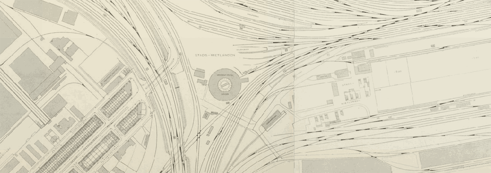

# Historical Maps for data.amsterdam.nl

Tools, scripts and data to generate tiles for data.amsterdam.nl from scanned historical maps from the Amsterdam City Archives.

[](https://amsterdam.github.io/historical-maps/viewer/28992.html)

This repository contains:

- GDAL scripts to create tiles from scanned maps
- MapServer and MapProxy Dockerfiles, to turn warped GeoTIFFs into tiles
- GeoJSON data of map sheets, collected and georectified by [Jan Hartmann](http://www.uva.nl/en/profile/h/a/j.l.h.hartmann/j.l.h.hartmann.html)

This repository will eventually contain:

- Links to [Stadsarchief Beeldbank](https://beeldbank.amsterdam.nl/beeldbank)
- Links to generated tiles (both in EPSG:28992 and EPSG:3857)
- Leaflet viewers to display those tiles

## Maps & Tiles

The following historical maps are currently availeble on data.amsterdam.nl:

| Year | Scale | Projection  | ID                             |
|:-----|:-------|:-----------|:-------------------------------|
| 1909 | 1:1000 | EPSG:28992 | `publieke-werken-1909-rd`      |
| 1943 | 1:1000 | EPSG:28992 | `publieke-werken-1943-rd`      |
| 1943 | 1:2500 | EPSG:28992 | `publieke-werken-1943-2500-rd` |
| 1985 | 1:1000 | EPSG:28992 | `publieke-werken-1985-rd`      |

You can use the following tile URLs:

| Jaar                                       | Tile-URL                            |
|:-------------------------------------------|:------------------------------------|
| [Dienst der Publieke Werken (1909, 1:1000)](https://amsterdam.github.io/historical-maps/viewer/28992.html?layer=publieke-werken-1909-rd#13/52.3591/4.9088) | `https://{s}.data.amsterdam.nl/publieke-werken-1909-rd/{z}/{x}/{y}.png` |
| [Dienst der Publieke Werken (1943, 1:1000)](https://amsterdam.github.io/historical-maps/viewer/28992.html?layer=publieke-werken-1943-rd#14/52.3612/4.9571) | `https://{s}.data.amsterdam.nl/publieke-werken-1943-rd/{z}/{x}/{y}.png` |
| [Dienst der Publieke Werken (1943, 1:2500)](https://amsterdam.github.io/historical-maps/viewer/28992.html?publieke-werken-1943-2500-rd#12/52.3555/4.8546) | `https://{s}.data.amsterdam.nl/publieke-werken-1943-2500-rd/{z}/{x}/{y}.png` |
| [Dienst der Publieke Werken (1985, 1:1000)](https://amsterdam.github.io/historical-maps/viewer/28992.html?layer=publieke-werken-1985-rd#14/52.3627/4.8827) | `https://{s}.data.amsterdam.nl/publieke-werken-1985-rd/{z}/{x}/{y}.png` |

Bounding boxes:

| ID                             | Bounding box                             |
|:-------------------------------|------------------------------------------|
| `publieke-werken-1909-rd`      | `[[52.3361, 4.8404], [52.4185, 4.9662]]` |
| `publieke-werken-1943-rd`      | `[[52.3292, 4.8382], [52.4173, 4.9646]]` |
| `publieke-werken-1943-2500-rd` |                                          |
| `publieke-werken-1985-rd`      | `[[52.2756, 4.7402], [52.4374, 5.0479]]` |

Four subdomains are available for our tile servers, you can tell Leaflet to substitute the `{s}` template with one of the strings `t1`, `t2`, `t3` or `t4`:

```js
var tileUrl = 'https://{s}.data.amsterdam.nl/publieke-werken-1909-rd/{z}/{x}/{y}.png'

L.tileLayer(tileUrl, {
  subdomains: ['t1', 't2', 't3', 't4'],
  maxZoom: 17
}).addTo(map)
```

## See Also

- https://github.com/Amsterdam/mapserver/blob/master/lufopyramids.sh
- https://gis.stackexchange.com/questions/27426/creating-a-mask-with-transparent-pixels-in-python
- http://www.gdal.org/frmt_gtiff.html
- https://smathermather.wordpress.com/2016/05/01/efficient-delivery-of-raster-data-part-4/
- https://smathermather.wordpress.com/2016/04/15/whichever-tiler-you-use-and-efficient-delivery-of-raster-data-image-pyramid-layer-update2/
- https://astuntech.atlassian.net/wiki/display/ISHAREHELP/Mosaic+thousands+of+raster+images
- http://blog.cleverelephant.ca/2015/02/geotiff-compression-for-dummies.html
- https://www.slidesearch.net/slide/geoserver-in-production-we-do-it-here-is-how-foss4g-2016
- https://www.mapbox.com/blog/super-sharp-pleiades-imagery-on-mapbox/
- https://github.com/boundlessgeo/workshops/blob/master/workshops/data_configs/sphinx/source/raster.rst
- http://www.ianturton.com/tutorials/bluemarble.html
